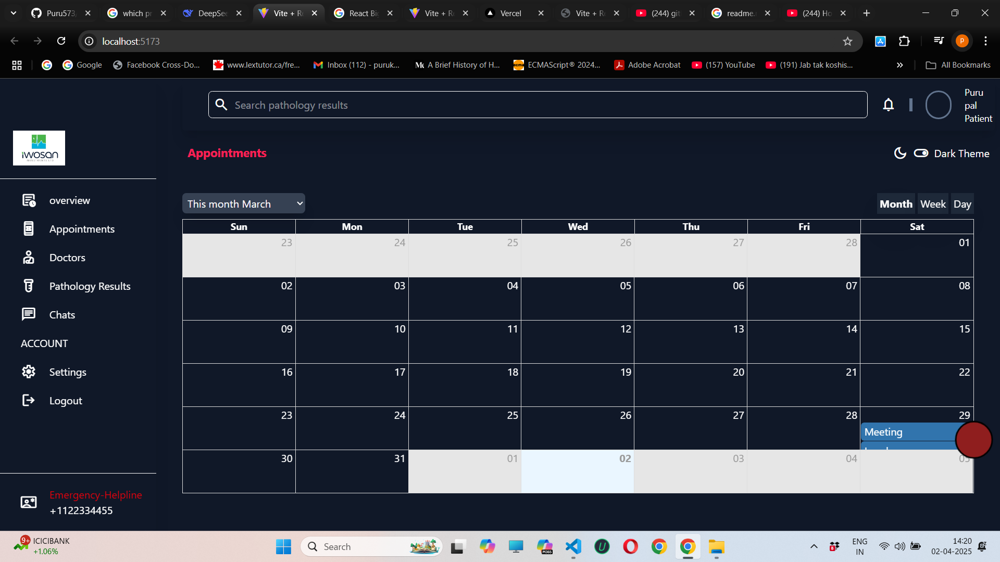

# Docotor Appointment App
User can book their appointment with the doctors and doctor can see their appointment with the user name,schedule of appointment and the name of the patient as well.

## Image

## How to install
1.first clone my project by writing the cmd ""git-clone<project-name>"" 
2.After clone run npm i 
3.that'it 

## contributor expectations
1.if you find any bug after clone raise the pr and also mention in my read me that what bug you have resolved.

